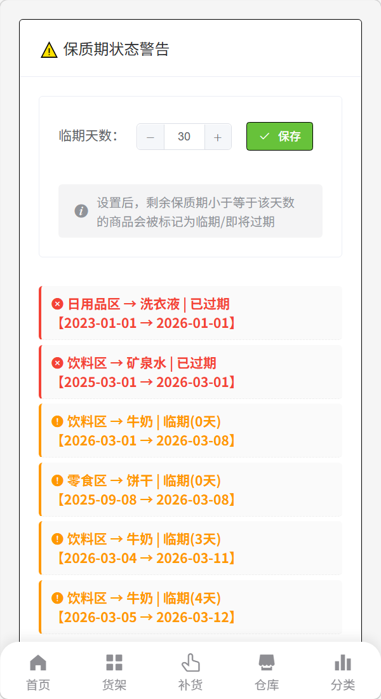
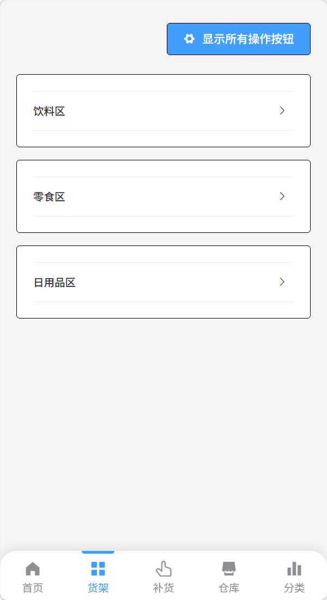
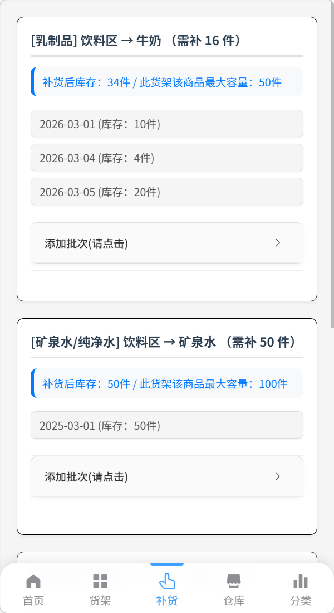
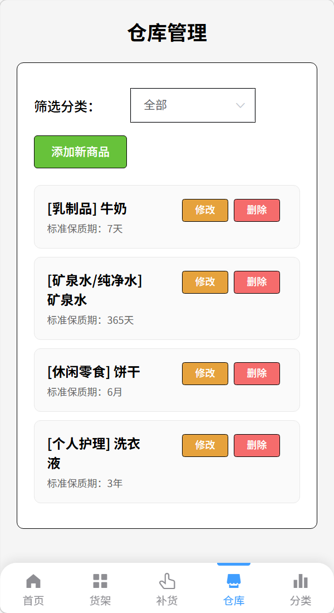
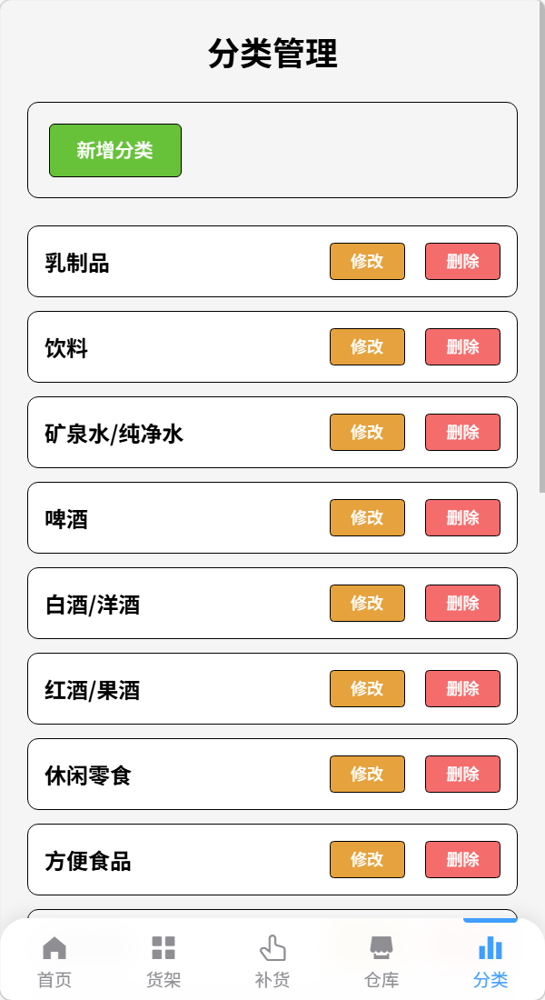

# 生产管理系统 (Production Manage System)

一个基于 Vue 2 + Element UI 的货架商品管理工具，支持多货架、商品分类、批次管理、保质期预警、补货建议等功能。所有数据均存储在浏览器本地（localStorage），无需后端服务，开箱即用。

[](https://vuejs.org/)
[](https://element.eleme.io/)
[](LICENSE)

---

## 📖 目录

- [生产管理系统 (Production Manage System)](#生产管理系统-production-manage-system)
  - [📖 目录](#-目录)
  - [✨ 特性](#-特性)
  - [🛠️ 技术栈](#️-技术栈)
  - [🚀 快速开始](#-快速开始)
    - [环境要求](#环境要求)
    - [安装依赖](#安装依赖)
    - [启动开发服务器](#启动开发服务器)
    - [构建生产版本](#构建生产版本)
  - [📁 项目结构](#-项目结构)
  - [📌 功能模块说明](#-功能模块说明)
    - [首页（Home）](#首页home)
    - [货架管理（Shelf）](#货架管理shelf)
    - [仓库管理（Warehouse）](#仓库管理warehouse)
    - [补货建议（Replenish）](#补货建议replenish)
    - [分类管理（Category）](#分类管理category)
  - [⚙️ 配置说明](#️-配置说明)
  - [📝 注意事项](#-注意事项)
  - [📸 截图](#-截图)
    - [首页](#首页)
    - [货架管理](#货架管理)
    - [补货建议](#补货建议)
    - [仓库管理](#仓库管理)
    - [分类管理](#分类管理)
  - [🤝 贡献](#-贡献)
  - [📄 许可证](#-许可证)

---

## ✨ 特性

- 🗂️ **货架管理**：创建/编辑/删除货架，管理每个货架上的商品及最大容量
- 📦 **商品管理**：添加/修改/删除商品，关联分类，设定标准保质期（天/月/年）
- 🏷️ **分类管理**：自定义商品分类，支持增删改
- ⚠️ **保质期预警**：根据生产日期和保质期自动计算过期日期，按设定阈值（如 7 天）提醒临期/过期商品
- 🔄 **补货建议**：自动计算各商品缺货数量，支持分批添加批次，预览补货后库存是否超限
- 💾 **本地持久化**：所有数据保存于浏览器 `localStorage`，刷新页面不丢失
- 📱 **移动端友好**：底部导航栏 + 自适应布局，操作方便

---

## 🛠️ 技术栈

| 层次         | 技术                                      |
| ------------ | ----------------------------------------- |
| 前端框架     | Vue 2 (2.6.11)                            |
| UI 组件库    | Element UI (2.15.14)                      |
| 状态管理     | Vuex (3.6.2)                              |
| 路由管理     | Vue Router (3.2.0)                        |
| 数据持久化   | localStorage（封装于 `utils/storage.js`） |
| CSS 预处理器 | Sass                                      |
| 构建工具     | Vue CLI 4.5.19                            |

---

## 🚀 快速开始

### 环境要求
- Node.js (建议 12.x 或 14.x)
- npm 或 yarn

### 安装依赖
- 克隆项目
```bash
git clone https://github.com/gezhe007/productionmanagesystem.git
cd productionmanagesystem
```

- 安装依赖
```bash
npm install
```

### 启动开发服务器
```bash
npm run serve
```
- 访问 http://localhost:8080 即可使用。

### 构建生产版本
```bash
npm run build
```
- 构建产物位于 dist/ 目录，可直接部署到任何静态服务器。

## 📁 项目结构

```text
src/
├── assets/                # 静态资源
├── components/            # 通用组件
│   └── ReplenishItem.vue  # 补货页面子组件
├── router/                # 路由配置
│   └── index.js
├── store/                 # Vuex 状态管理
│   └── index.js
├── utils/                 # 工具函数
│   ├── helpers.js         # 日期计算、表单验证、ID生成等
│   └── storage.js         # localStorage 封装
├── views/                 # 页面视图
│   ├── Home.vue           # 首页（保质期预警）
│   ├── Shelf.vue          # 货架管理
│   ├── Warehouse.vue      # 仓库管理（商品列表）
│   ├── Replenish.vue      # 补货建议
│   └── Category.vue       # 分类管理
├── App.vue                # 根组件（底部导航栏）
└── main.js                # 入口文件
``` 
## 📌 功能模块说明
### 首页（Home）
1. 设置临期提醒天数（1~30天）
2. 展示所有临期/过期批次，按状态颜色区分（红色=过期，橙色=临期）

### 货架管理（Shelf）
1. 展示所有货架，每个货架内包含商品及批次
   
2. 新增/修改/删除货架
   
3. 向货架添加商品（选择仓库中已存在的商品）
   
4. 修改商品最大容量
   
5. 为商品添加批次（输入生产日期和数量，自动计算过期日期）
   
6. 调整批次数量

7.  删除批次或商品

8.  顶部“显示/隐藏所有操作按钮”可切换操作控件的可见性，方便日常查看

### 仓库管理（Warehouse）
1. 管理所有商品（与货架解耦）
   
2. 支持按分类筛选

3. 新增商品（名称、分类、保质期数值和单位）

4. 修改商品信息（修改后自动更新关联批次的过期日期）

5. 删除商品（同时删除关联的货架记录和批次）

### 补货建议（Replenish）
1. 自动计算每个货架商品当前库存与最大容量的差值，列出需补货商品

2. 可分批添加待补货批次（生产日期、数量）

3. 实时预览补货后库存，若超出最大容量会红色提示

4. 确认补货后将批次真正写入批次列表
   
### 分类管理（Category）
1. 添加/修改/删除商品分类

2. 删除分类前会检查是否被商品引用

## ⚙️ 配置说明
1. 临期阈值：可在首页调整，保存后影响所有批次的过期状态显示

2. 数据重置：若需清空所有数据，可在浏览器开发者工具的 Application → Local Storage 中删除对应键值，或调用 CLEAR_ALL_DATA mutation（目前未在界面暴露，可自行添加按钮）

## 📝 注意事项
1. 所有数据仅存储在浏览器本地，清除浏览器缓存会导致数据丢失

2. 批次的生产日期不能晚于今天（日期选择器已限制）

3. 商品的最大容量修改时不能小于当前已有库存

4. 删除分类或商品前请确保没有关联引用，否则会提示失败

## 📸 截图
### 首页


### 货架管理


### 补货建议


### 仓库管理


### 分类管理


## 🤝 贡献
欢迎提交 Issue 或 Pull Request。如有问题，请通过 GitHub Issues 反馈。


## 📄 许可证
[LICENSE](LICENSE)
